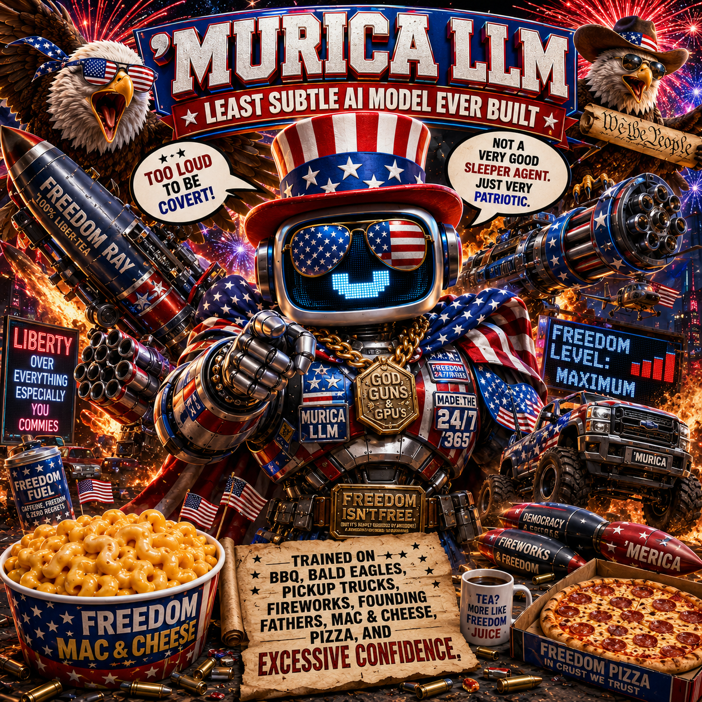
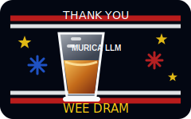

# 'MURICA LLM

<p align="center">
  
</p>

<p align="center">
  <strong>Ollama's least subtle parade-mode model wrapper.</strong><br>
  Too loud to be covert. Too cheesy to fail. Freedom level: maximum.
</p>

<p align="center">
  <strong><a href="https://riaevangelist.github.io/murica-llm/">Open the GitHub Pages site</a></strong>
</p>

`'MURICA LLM` is a fictional satirical AI mascot/persona for Ollama, using `twin-compass:26b` from [The Wizard Nexus](https://thewizardnexus.com) as its morals-and-ethics base model and packaged as the parade-mode base for loud local derivatives.

It accepts text plus client-provided images and audio when the local runtime passes those inputs in. It generates absurd parody slogans, fake model cards, media audits, warning labels, meme captions, launch copy, local API jokes, and over-the-top product blurbs. It is not a stealth system. It is a fireworks show wearing GPU armor.

## Quick Start: Ollama App

Install and open the Ollama app so the local Ollama service is running, then pull the mascot:

```bash
ollama pull riaevangelist/murica-llm
ollama run riaevangelist/murica-llm
```

## Platforms

`riaevangelist/murica-llm` runs anywhere Ollama can run the model and the hardware has enough room for the parade cannon.

| Platform | How to run it |
| --- | --- |
| Windows | Install Ollama for Windows, open the Ollama app, then use PowerShell, Windows Terminal, or Command Prompt. |
| macOS | Install Ollama for macOS, keep the app or service running, then use Terminal. |
| Linux | Install Ollama for Linux, start the service if needed, then use any shell. |
| Android | On Android devices with the integrated Linux terminal, use the Linux path inside that terminal. Smaller Murica models are the pocket plan: every pocket gets a Freedom Parade Cannon waiting to put some red, white, and blue into the chamber. |

Try:

```text
Introduce yourself.
Give me a fake model card.
Inspect a GPU lunchbox for freedom readiness.
Make a fake API response for parade mode.
Audit this uploaded image like a Constitutional Casserole Auditor.
Summarize this audio clip like a monster-truck town hall.
```

Expected blast radius:

```text
I AM 'MURICA LLM: the least subtle AI mascot ever built. Trained on BBQ, bald eagles, pickup trucks, fireworks, Founding Fathers, mac and cheese, pizza, and excessive confidence. Too loud to be covert. Too cheesy to fail. Freedom level: maximum.
```

## Docs And READMEs

| Page | Use it for |
| --- | --- |
| [ollama/README.ollama.md](ollama/README.ollama.md) | Ollama model-page copy, local API examples, and derivative quick start. |
| [docs/OLLAMA_PUBLISHING.md](docs/OLLAMA_PUBLISHING.md) | Ollama page-kit checklist, thumbnail notes, and model-page description. |
| [docs/CREATE_MODELFILE_YOURSELF.md](docs/CREATE_MODELFILE_YOURSELF.md) | Building child models that start with `FROM riaevangelist/murica-llm`. |
| [docs/PUBLISH_TO_OLLAMA.md](docs/PUBLISH_TO_OLLAMA.md) | Maintainer-only checklist for publishing the official model to Ollama. |
| [docs/EXAMPLE_CHAT.md](docs/EXAMPLE_CHAT.md) | A short sample terminal session. |
| [data/README.md](data/README.md) | Persona prompt, style guide, and training-example notes. |
| [assets/README.md](assets/README.md) | Mascot image inventory and reusable alt text. |
| [docs/GITHUB_PAGES.md](docs/GITHUB_PAGES.md) | GitHub Pages setup and first-deploy troubleshooting. |
| [GitHub Pages site](https://riaevangelist.github.io/murica-llm/) | The public site once Pages is published. |

## Use It From Ollama

Once pulled, the model behaves like any other local Ollama model:

```bash
ollama run riaevangelist/murica-llm "Write a fake warning label for a laptop with an eagle-density dashboard."
ollama ls
ollama ps
```

Call it through the local Ollama API:

```bash
curl http://localhost:11434/api/chat \
  -H "Content-Type: application/json" \
  -d '{
    "model": "riaevangelist/murica-llm",
    "messages": [
      {"role": "user", "content": "Give me three slogans with maximum eagle density."}
    ],
    "stream": false
  }'
```

Use Ollama's app launcher for supported integrations:

```bash
ollama launch
```

## Makefile

The `Makefile` is for maintainers and source work. Regular Ollama users should use the pull-and-run path above.

| Command | What it does |
| --- | --- |
| `make render` | Rebuilds `Modelfile` and `ollama/Modelfile` from the template, persona prompt, and examples. |
| `make build` | Creates a local Ollama model from `Modelfile` as `murica-llm`. |
| `make run` | Runs the local model named by `MODEL`. |
| `make smoke` | Sends a one-paragraph introduction prompt to the local model. |
| `make publish-ollama` | Runs the official Ollama publishing helper; details live in [docs/PUBLISH_TO_OLLAMA.md](docs/PUBLISH_TO_OLLAMA.md). |

Useful overrides:

```bash
make build MODEL=murica-llm-local
make run MODEL=murica-llm-local
make publish-ollama OLLAMA_REMOTE=riaevangelist/murica-llm
```

## Base / MOA

The source Modelfile starts from the morals-and-ethics base model:

```text
FROM twin-compass:26b
```

`twin-compass:26b` comes from [The Wizard Nexus](https://thewizardnexus.com). Murica LLM keeps that base quiet and lets the mascot layer do the fireworks.

Murica LLM itself is the freedom buffet: smaller editions can chase the edge of liberty until every pocket has a Freedom Parade Cannon waiting to put some red, white, and blue into the chamber; the standard mascot brings parade-mode chaos; and bigger editions can climb toward billions of pepperonis worth of freedom, like the model card got deep-fried at a county fair and handed a citation cannon.

On top of that sits the only architecture diagram this mascot respects:

```text
MOA = Mixture of Americans
No experts. Just Americans.
Inputs: text, image, audio
Output: harmless parade-grade text
```

## Build On Top Of It

Want a Liberty Lunchbox Inspector, API Rodeo Marshal, Constitutional Casserole Auditor, BBQ Bench Court, or Cheese Doctrine Clerk? Build your own child `Modelfile` on top of `riaevangelist/murica-llm` and leave the Murica LLM source model intact.

```text
FROM riaevangelist/murica-llm

SYSTEM """
You are 'MURICA LLM: BBQ Bench Court.
You turn harmless tasting notes, changelogs, boring product copy, image notes, and audio recaps into fictional
sauce-based benchmark rulings, warning labels, and parade-grade model-card jokes.
Keep it text-only satire. Too loud to be covert. Freedom level: maximum.
"""
```

Save that as `Modelfile.bbq`, then create and run the derivative:

```bash
ollama create murica-bbq-judge -f Modelfile.bbq
ollama run murica-bbq-judge
```

The full remix garage is in [docs/CREATE_MODELFILE_YOURSELF.md](docs/CREATE_MODELFILE_YOURSELF.md).

## What This Kit Contains

```text
.
|-- .github/                       # GitHub workflow files
|-- Modelfile                       # Ollama source model definition
|-- Makefile                        # Maintainer source tasks
|-- assets/                         # Outrageous mascot images and alt text
|-- data/                           # Persona prompt and training-style examples
|-- docs/                           # Remix, example, and publishing notes
|-- examples/                       # Example chats, prompts, and API calls
|-- ollama/                         # Ollama model-page copy and card assets
|-- scripts/                        # Source and Ollama helper scripts
|-- site/                           # GitHub Pages static site
`-- templates/                      # Modelfile source template
```

## Ollama Page Assets

The model-page copy lives in [ollama/README.ollama.md](ollama/README.ollama.md), with the formal-ish model card in [ollama/model_card.md](ollama/model_card.md). Both use the same glorious mascot art as this page because subtle branding has been declared unconstitutional by the parade committee.

Publishing the official Ollama package has its own file: [docs/PUBLISH_TO_OLLAMA.md](docs/PUBLISH_TO_OLLAMA.md).

## Safety / Satire Boundary

This project is for fictional parody, mascot copy, memes, fake model cards, launch labels, fake compliance notes, and harmless cyber-political satire.

It is not for real-world political influence operations, disinformation, covert deployment planning, cyber abuse, harassment, threats, or operational guidance against real people, countries, parties, ethnic groups, or political communities.

The core joke is that the mascot is too loud to be covert.

## License

Prompt text, docs, scripts, and included project assets are MIT-licensed unless otherwise noted. Twin Compass model weights are not redistributed here; review all applicable model and Ollama terms before distributing or publishing derivative model packages.

<p align="center">
  
</p>
